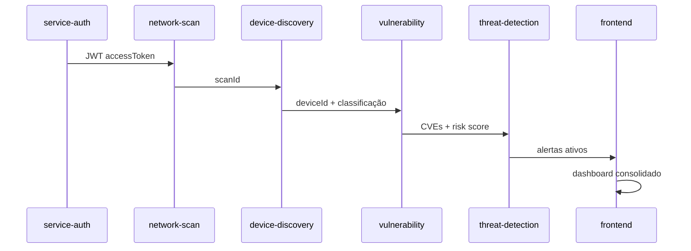

# ScanDark — Documentação

Documentação técnica da plataforma ScanDark. Este hub centraliza guias de arquitetura, API, desenvolvimento e operação.

**Autor:** Francisco Stanley Rodrigues Albuquerque

---

## Comece aqui

| Ordem | Documento | Para quem |
|-------|-----------|-----------|
| 1 | [Getting Started](./getting-started.md) | Novos desenvolvedores — instalação e primeiro acesso |
| 2 | [Arquitetura](./architecture.md) | Arquitetos e tech leads — visão do sistema |
| 3 | [Desenvolvimento](./development.md) | Contribuidores — workflow e convenções |
| 4 | [API Gateway](./api/gateway.md) | Integradores — rotas e autenticação |

---

## Índice completo

### Fundamentos

| Documento | Descrição |
|-----------|-----------|
| [Getting Started](./getting-started.md) | Instalação, URLs, troubleshooting |
| [Arquitetura](./architecture.md) | Diagramas, Clean Architecture, SOLID, bounded contexts |
| [Desenvolvimento](./development.md) | Monorepo, scripts, convenções de código |
| [Variáveis de ambiente](./environment-variables.md) | Referência completa do `.env` |
| [Testes](./testing.md) | Vitest, coverage, estratégia de testes |
| [Deploy](./deployment.md) | Produção, Docker, checklist de segurança |

### API

| Documento | Descrição |
|-----------|-----------|
| [Visão geral da API](./api/README.md) | Autenticação, versionamento, Swagger |
| [API Gateway](./api/gateway.md) | Rotas proxy, headers, exemplos cURL |
| [Postman / Insomnia](../postman/README.md) | Collections importáveis |

### Microserviços

| Serviço | Porta | Documento |
|---------|-------|-----------|
| API Gateway | 3000 | [gateway.md](./api/gateway.md) |
| service-auth | 3001 | [service-auth.md](./services/service-auth.md) |
| service-network-scan | 3002 | [service-network-scan.md](./services/service-network-scan.md) |
| service-device-discovery | 3003 | [service-device-discovery.md](./services/service-device-discovery.md) |
| service-vulnerability | 3004 | [service-vulnerability.md](./services/service-vulnerability.md) |
| service-threat-detection | 3005 | [service-threat-detection.md](./services/service-threat-detection.md) |

Catálogo resumido: [services/README.md](./services/README.md)

### Segurança

| Documento | Descrição |
|-----------|-----------|
| [Threat Detection](./security/threat-detection.md) | Cenários, thresholds, remediação |
| [SECURITY.md](../SECURITY.md) | Política de reporte de vulnerabilidades |

### Frontend

| Documento | Descrição |
|-----------|-----------|
| [Frontend](./frontend/README.md) | Next.js, páginas, design system, API client |

---

## Mapa de portas

| Serviço | Porta HTTP | Swagger |
|---------|------------|---------|
| API Gateway | 3000 | `/docs` |
| service-auth | 3001 | `/docs` |
| service-network-scan | 3002 | `/docs` |
| service-device-discovery | 3003 | `/docs` |
| service-vulnerability | 3004 | `/docs` |
| service-threat-detection | 3005 | `/docs` |
| Frontend | 3100 | — |

### Infraestrutura Docker

| Serviço | Porta | Credenciais padrão (dev) |
|---------|-------|--------------------------|
| PostgreSQL | 5432 | `scandark` / `scandark_secret` |
| Redis | 6379 | — |
| RabbitMQ (AMQP) | 5672 | `scandark` / `scandark_secret` |
| RabbitMQ (UI) | 15672 | `admin` / `change-me-management-password` |

---

## Stack

| Camada | Tecnologias |
|--------|-------------|
| Backend | NestJS 11, TypeORM, PostgreSQL, JWT, Swagger, Vitest |
| Frontend | Next.js 15, React 19, Tailwind CSS |
| Infra | Docker Compose, Redis, RabbitMQ |
| Monorepo | pnpm workspaces, Turborepo, TypeScript 5 |

---

## Fluxo de dados típico

---

## Links externos

- [CONTRIBUTING.md](../CONTRIBUTING.md) — Guia de contribuição
- [CHANGELOG.md](../CHANGELOG.md) — Histórico de versões
- [LICENSE](../LICENSE) — MIT License
- [AUTHORS.md](../AUTHORS.md) — Autoria do projeto
