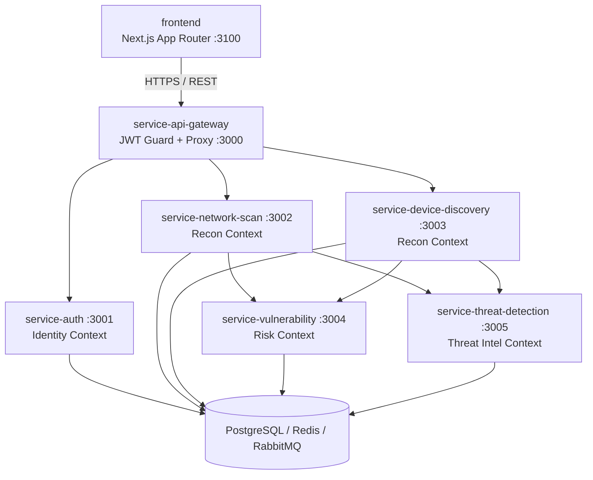
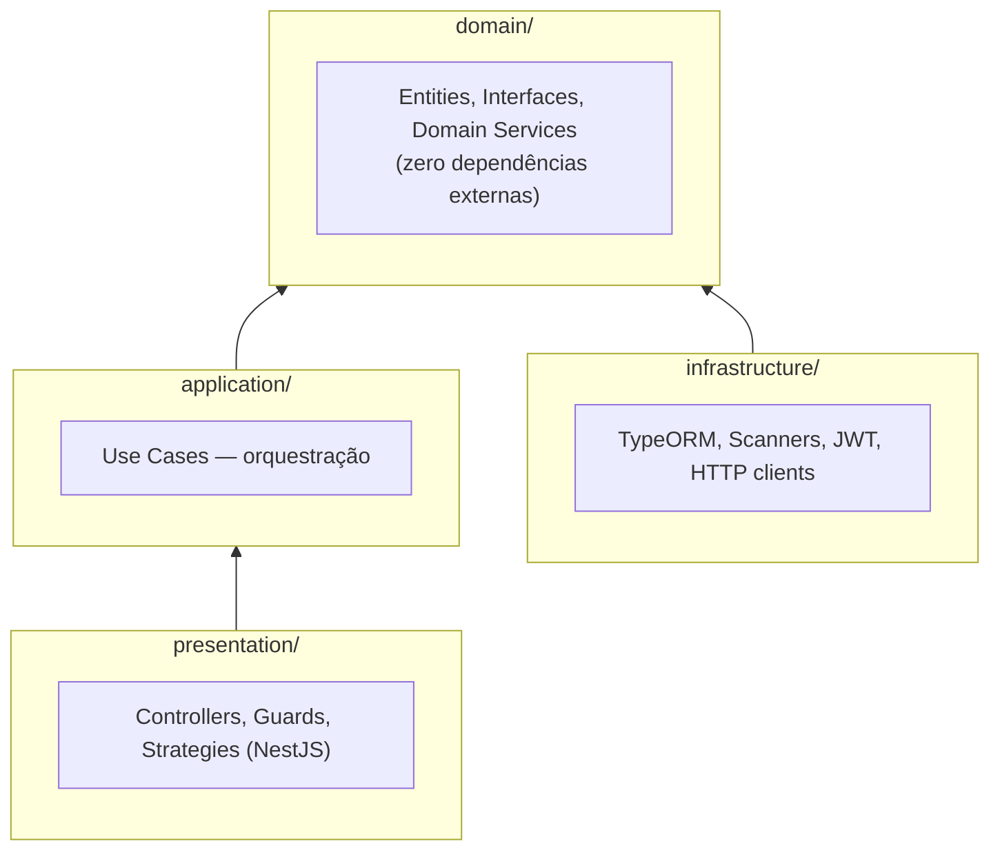
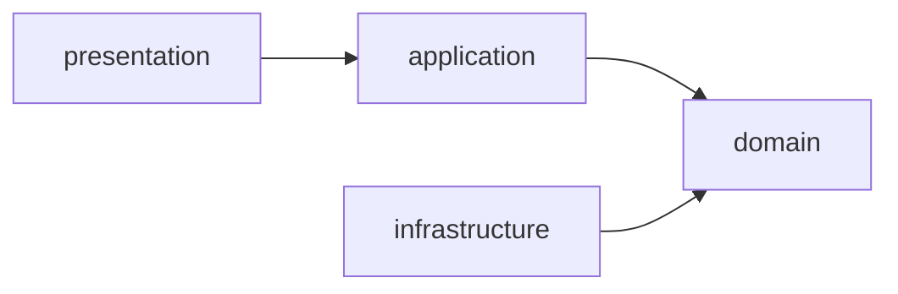
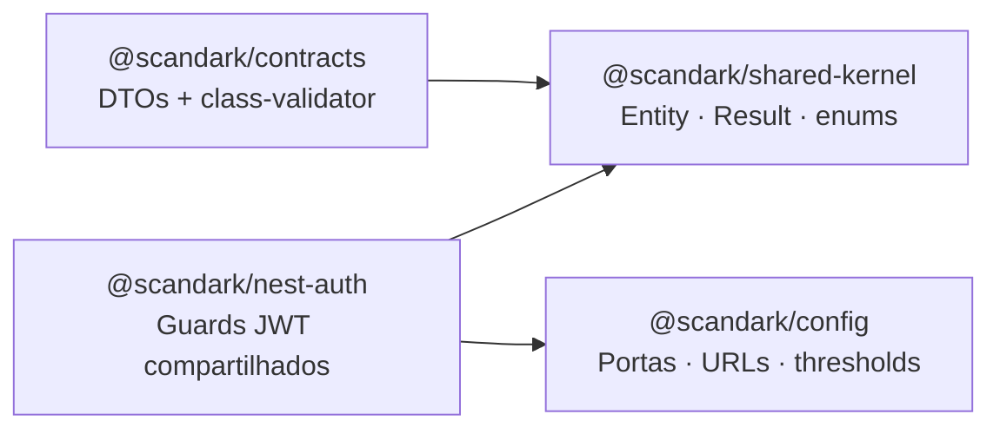
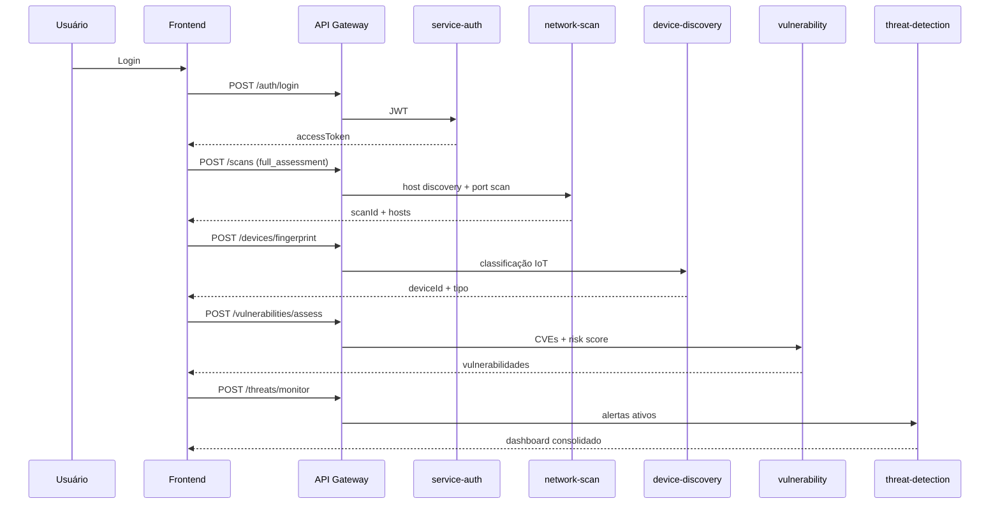
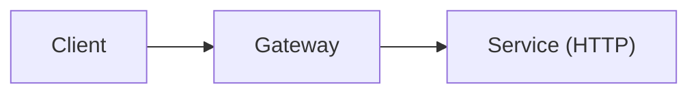
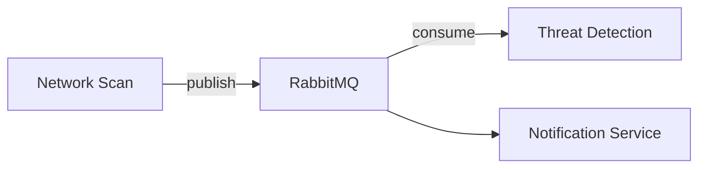

# Arquitetura

Documentação arquitetural da plataforma ScanDark — visão de sistema, princípios de design e bounded contexts.

---

## Visão geral do sistema

---

## Estilo arquitetural

| Aspecto | Decisão |
|---------|---------|
| Padrão | Microserviços com API Gateway |
| Comunicação | REST síncrona (HTTP) |
| Persistência | PostgreSQL via TypeORM |
| Mensageria | RabbitMQ (assíncrono — roadmap) |
| Cache | Redis (roadmap) |
| Autenticação | JWT stateless |
| Monorepo | pnpm workspaces + Turborepo |

---

## Clean Architecture (por microserviço)

Cada serviço isola regras de negócio de frameworks e infraestrutura:

### Regra de dependência

O **domain** define interfaces (ports). A **infrastructure** implementa (adapters).

---

## Princípios SOLID

| Princípio | Aplicação no ScanDark |
|-----------|----------------------|
| **S** — Single Responsibility | Um use case = uma ação (`CreateNetworkScanUseCase`) |
| **O** — Open/Closed | Novos scanners via `INetworkScanner` sem alterar use cases |
| **L** — Liskov Substitution | `TypeOrmUserRepository` substituível por in-memory em testes |
| **I** — Interface Segregation | `IWifiAuditor`, `IRouterAuditor` separados |
| **D** — Dependency Inversion | Use cases dependem de abstrações via Symbol tokens |

---

## Bounded Contexts (DDD)

| Context | Serviços | Responsabilidade |
|---------|----------|------------------|
| **Identity** | service-auth | Usuários, JWT, RBAC |
| **Network Reconnaissance** | network-scan, device-discovery | Descoberta e classificação |
| **Risk Assessment** | service-vulnerability | CVE, severidade, remediação |
| **Threat Intelligence** | service-threat-detection | Intrusões, alertas, monitoramento |

Comunicação entre contexts via API REST (anti-corruption layer no gateway).

---

## Packages compartilhados

| Package | Conteúdo | Dependências |
|---------|----------|--------------|
| `@scandark/shared-kernel` | `Entity`, `Result`, enums, erros | Nenhuma |
| `@scandark/contracts` | DTOs + class-validator | shared-kernel |
| `@scandark/config` | Portas, URLs, `IOT_SIGNATURES` | Nenhuma |

---

## Fluxo de dados — Avaliação completa

---

## Comunicação entre serviços

### Atual (síncrona)

O gateway valida JWT e injeta `x-user-id` para services que precisam de contexto de usuário.

### Roadmap (assíncrona)

Casos de uso: scans longos, alertas em tempo real, retry de jobs.

---

## Decisões arquiteturais (ADRs resumidos)

| # | Decisão | Justificativa |
|---|---------|---------------|
| ADR-001 | Microserviços vs monolito | Domínios distintos (auth, scan, threats) com escalabilidade independente |
| ADR-002 | Clean Architecture | Testabilidade e isolamento de regras de negócio |
| ADR-003 | API Gateway centralizado | Ponto único de auth, CORS e roteamento |
| ADR-004 | JWT stateless | Simplicidade; refresh token para sessões longas |
| ADR-005 | Monorepo pnpm | Compartilhamento de contratos sem publicar npm packages |
| ADR-006 | Vitest | Velocidade e compatibilidade com Jest API |

---

## Segurança arquitetural

| Camada | Mecanismo |
|--------|-----------|
| Gateway | JWT validation, CORS |
| Services | Bearer auth, RBAC (futuro por endpoint) |
| Network | Scans restritos a redes autorizadas |
| Data | PostgreSQL com credenciais via env |
| Secrets | Nunca em código; `.env` gitignored |

---

## Referências

- [Desenvolvimento](./development.md)
- [API Gateway](./api/gateway.md)
- [Threat Detection](./security/threat-detection.md)
- [Deploy](./deployment.md)
