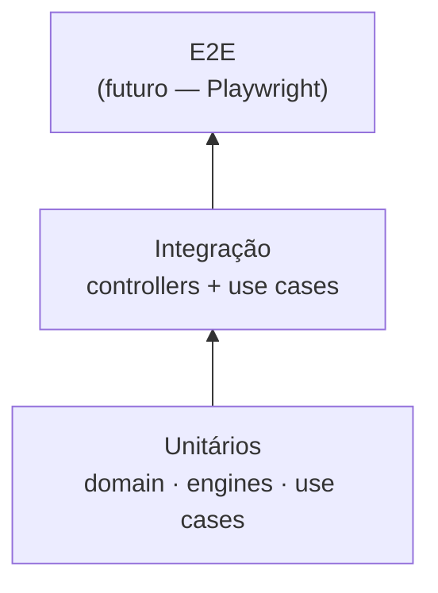

# Testes

Estratégia de testes e guia para executar a suíte Vitest do ScanDark.

---

## Executar testes

```bash
# Todos os workspaces
pnpm test

# Com coverage
pnpm test:cov

# Serviço específico
pnpm --filter service-threat-detection test
pnpm --filter service-vulnerability test:cov
```

---

## Framework

| Ferramenta | Uso |
|------------|-----|
| **Vitest** | Test runner (compatível com Jest API) |
| **@nestjs/testing** | Módulos NestJS em testes de integração |
| **supertest** | Testes HTTP (quando aplicável) |

Configuração por serviço em `vitest.config.ts` ou `package.json`.

---

## Estratégia

### Pirâmide de testes



### O que testar

| Camada | Prioridade | Exemplos |
|--------|------------|----------|
| **Domain engines** | Alta | `DeviceFingerprintEngine`, `IntrusionDetectionEngine`, `VulnerabilityAssessmentEngine` |
| **Use cases** | Alta | `LoginUserUseCase`, `EnsureDefaultUserUseCase`, `CreateNetworkScanUseCase` |
| **Proxy / infra** | Alta | `ServiceProxy` (encaminhamento de `Authorization` no gateway) |
| **Controllers** | Média | Validação de DTOs, status codes |
| **Infrastructure** | Baixa | Mocks de repositórios; testes de integração com DB separados |

### O que mockar

- Repositórios (`IUserRepository`, etc.)
- Serviços externos (scanners de rede em CI)
- JWT / Passport em testes de controller

---

## Estrutura de arquivos

```
services/service-example/
├── src/
│   └── domain/services/
│       └── my.engine.spec.ts      # Colocated com o engine
└── test/
    └── app.e2e-spec.ts            # E2E (futuro)
```

Convenção: `*.spec.ts` ao lado do arquivo testado ou em `test/`.

---

## Exemplo — teste de domain engine

```typescript
import { describe, it, expect } from 'vitest';
import { DeviceFingerprintEngine } from './device-fingerprint.engine';

describe('DeviceFingerprintEngine', () => {
  const engine = new DeviceFingerprintEngine();

  it('classifies Hikvision camera by RTSP port and hostname', () => {
    const result = engine.fingerprint({
      ipAddress: '192.168.1.100',
      hostname: 'Hikvision IPC',
      openPorts: [80, 554],
    });

    expect(result.deviceType).toBe('camera');
    expect(result.confidence).toBeGreaterThan(0.7);
  });
});
```

---

## Coverage

```bash
pnpm test:cov
```

Relatórios gerados em `coverage/` de cada serviço (gitignored).

### Metas sugeridas

| Camada | Meta |
|--------|------|
| Domain engines | ≥ 80% |
| Use cases | ≥ 70% |
| Controllers | ≥ 60% |

---

## CI

Testes rodam automaticamente em:

- **GitHub Actions:** `.github/workflows/ci.yml`
- **GitLab CI:** `.gitlab-ci.yml`

Pipeline: `install → lint → test → build`

---

## Boas práticas

1. **Testes determinísticos** — sem dependência de rede real em unit tests
2. **Nomes descritivos** — `it('detects SSH brute force after 5 failed attempts')`
3. **Arrange-Act-Assert** — estrutura clara
4. **Um assert por comportamento** — múltiplos `expect` ok se testam o mesmo cenário
5. **Não teste implementação** — teste comportamento observável

---

## Referências

- [Desenvolvimento](./development.md)
- [CONTRIBUTING.md](../CONTRIBUTING.md)
